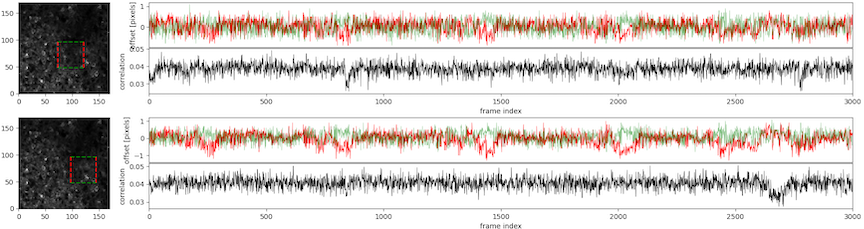
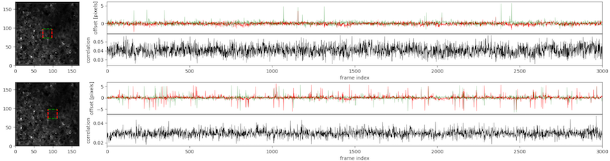
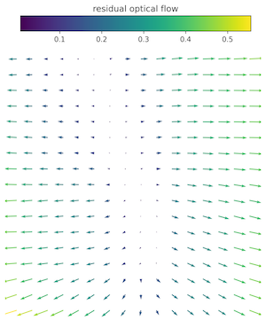
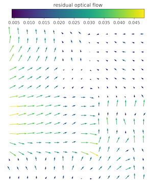

# Motion Correction

This capsule performs motion correction using Suite2p. The default is piece-wise rigid motion correction as in NoRMCorre.

## Input

All parameters are passed to registration.py using `python registration.py [parameters]`
All parameters are defined in __main__ using argparse. The most important one is
'input-filename' which should point at an hdf5 file with a 'data' 3D array. 

## Output

The main output is the motion corrected h5 data file, defaults to `[input]_registered.h5` for raw data `[input].h5`.

The motion transform offsets are stored as csv file (for historic LIMS reasons), defaults to `[input]_motion_transform.csv`.

For QC some videos and figures are created:
- `motion_correction_preview_output`, default `[input]_motion_preview.webm`
- `max_projection_output`, default `[input]_maximum_projection.png`
- `avg_projection_output`, default `[input]_average_projection.png`
- `registration_summary_output`, defaults are    
`[input]_registration_summary.png`  
`[input]_registration_summary_nonrigid.png`   
`[input]_registration_summary_PCxhigh.png`   
`[input]_registration_summary_PCxlow.png`   
`[input]_registration_summary_PCxrow.png`

### Interpreting the outputs: How to tell if motion correction worked well 
**Movie**
- No residual motion is noticeable in the motion corrected preview video (on the right side).
**Images**
- The average and maximum projection images look sharp, not blurry.
- The correction offset in the registration summary image does not contain outliers.
- The correction offsets of the individual patches in the nonrigid registration summary image do not contain outliers. If they do, the `block_size` was likely too small for the data's noise level.   
good block size   
   
too small blocks   

- Comparing the images of `PCxhigh` and `PCxlow` (x is number of the PC) does not reveal residual motion but different cells being active.   
PCxhigh and PCxlow are obtained from the top prinicipal components of the registered movie (each averaging similar frames together to reduce noise), so that they capture the variation in the data. This variation should be due to changes in neural activity not residual motion.
- The residual optical flow `PCxrof` between `PCxhigh` and `PCxlow` has values close to zero.   
To obtain `PCxrof`, `PCxhigh` and `PCxlow` are aligned using OpenCV's implementation of Farneback's method, thus we further rely on an independent method not just Suite2p's own.   
Reducing a large block size (left) to a good block size (right) reduces the residual optical flow to almost zero.   
        
**Numbers**
- The scores in `[input]_registered.h5`'s datasets `'reg_metrics/regDX'` and `'reg_metrics/farnebackDX'` are very close to zero.   
These are summary statistics for all computed 30 PCs, the PC images are created for PC x that shows the most extreme residual motion.
- The crispness (norm of the average image's acutance) in `[input]_registered.h5`'s dataset `'reg_metrics/crispness'` increases from raw (1st value) to registered (2nd value) movie.

